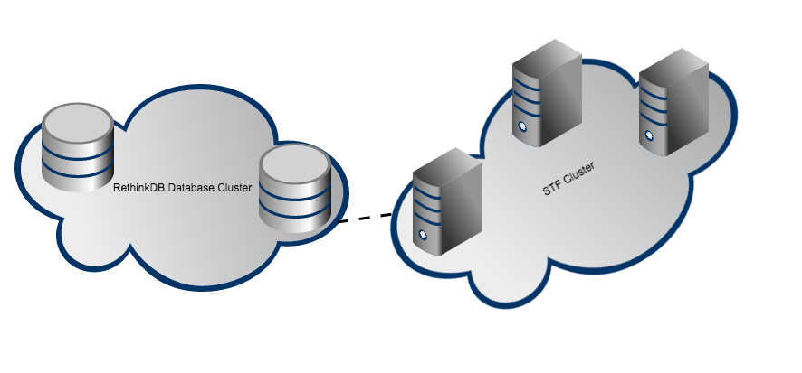

## Smartphone Test Farm Setup Examples

[Smartphone Test Farm](https://github.com/openstf/stf) is a great tool to create on-premise device farm. And also, it is very easy to get started with it using it's `stf local` feature. But the problem is this feature was developed for debugging purpose. Users are not supposed to use it in production environment. It is okay to use it for a small farm of 10 ~ 15 devices with one host machine. But to scale the service you will have to deploy it on a computer cluster.

This project will provide various setup examples for STF in production environment. I will be using [Vagrant](https://www.vagrantup.com/) with [VirtualBox](https://www.virtualbox.org/) provider to create virtual cluster for demonstration.

## Assumptions
- This project assumes that you already have read following nicely written documents. In case you haven't read, it is highly recommended to read them before going ahead.
  - [STF README](https://github.com/openstf/stf/blob/master/README.md)
  - [STF DEPLOYMENT DOC](https://github.com/openstf/stf/blob/master/doc/DEPLOYMENT.md)
- You are on OS X
  - *Theoritically this can be done on any OS which supports VirtualBox and Vagrant but they haven't been confirmed*

## Requirements
- [VirtualBox](https://www.virtualbox.org/) >= 5.0.0
- [Vagrant](https://www.vagrantup.com/) >= 1.7.3

## Setup Architecture
Before going any further, I am going to give you a brief idea about what kind of setups are we going to do. Most of the setups will have two major components.
- Database Cluster
  - Cluster for running database. [Rethinkdb](https://www.rethinkdb.com) cluster.
- STF Cluster
  - Cluster where STF components will be running. (CoreOS, Ubuntu etc)



We will be creating these clusters using Vagrant and VirtualBox. And then deploy various software components on these clusters. By the end of these tutorial, you will have a running STF on your VMs which you will be able to access on http://stf.mydomain.org from your browser. Stay Excited!

## Setup

```sh
git clone https://github.com/openstf/setup-examples.git stf-setup-examples
cd stf-setup-examples
```

## Create Rethinkdb Cluster

Lets create rethinkdb cluster. Go to the `db` folder and run `vagrant up`. Yeah, thats it.

```sh
cd ./db
vagrant up
```
Above command will do following things
- Download **ubuntu/trusty64** image if image is not present (*this may take time depending on internet speed*)
- Launch Ubuntu VM and set its IP to `$rethinkdb_host_ip` configured in [Configuration File](config.rb) (**Default: 198.162.50.11**)
- Install and run rethinkdb server

You can confirm if rethinkdb is up by visiting rethinkdb admin console (http://198.162.50.11:8080 or http://RETHINKDB_HOST_IP:8080)

Please have a look at [Vagrantfile](db/Vagrantfile) to have better understanding about what is happening.

TODO: Use 2 instances of VM for rethinkdb if somebody complains that this is not a real cluster :P

## Create STF Cluster

Please check following host specific docs for STF cluster creation and deployment strategy.

- [CoreOS + Fleet](docs/coreos_fleet.md)
